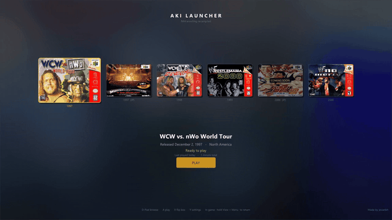

# AKI Launcher

A native Windows hub for the AKI-engine N64 wrestling game recompilations.
Browse the library as a box-art carousel, download each game's PC port
directly from its GitHub releases, and launch into any of them seamlessly —
with a Return to Launcher shortcut to hop back out of a game.

**This repository and its releases do not contain game assets or ROMs. Each
game requires the user's own legally dumped ROM.**



*Full demo — including the in-game Return to Launcher and a second launch:
[docs/demo.mp4](docs/demo.mp4)*

## The games it launches

| Game | Port | Required ROM (unmodified big-endian .z64) — SHA1 |
|---|---|---|
| WCW vs. nWo World Tour | [WCWvsNWOWorldTourRecomp](https://github.com/jessetbh/WCWvsNWOWorldTourRecomp) | North American (NTSC-U) — `5AD2D8359058C8BB71F08E3D3433B7A50D3BB645` |
| Virtual Pro Wrestling 64 | [VPW64Recomp](https://github.com/jessetbh/VPW64Recomp) | Japanese (Japan-only) — `F9E9FA2ED819C3A39DB5CB6AFECA186F021DB5ED` |
| WCW/nWo Revenge | [WCWnWoRevengeRecomp](https://github.com/jessetbh/WCWnWoRevengeRecomp) | North American (NTSC-U) — `E1711A2511394B9357B5F1AC8CA5CC17BD674836` |
| WWF WrestleMania 2000 | [WWFWrestleMania2000Recomp](https://github.com/jessetbh/WWFWrestleMania2000Recomp) | North American (NTSC-U) — `D7D1FAD473FEF9B61FE5F8273C975EE7C603A51B` |
| Virtual Pro Wrestling 2 | [VPW2Recomp](https://github.com/jessetbh/VPW2Recomp) | Japanese (Japan-only; fan-translation patches won't match) — `82DD25A044689EAB57AB362FE10C0DA6388C217A` |
| WWF No Mercy | [WWFNoMercyRecomp](https://github.com/jessetbh/WWFNoMercyRecomp) | North American (NTSC-U) **Rev 1** (Rev 0 won't match) — `91CEE3D096F4A76644D8B35B9AEAD6448909ABD1` |

Each port is a static recompilation — the original N64 game running as a
native PC app (no emulator), with RT64 rendering, high frame-rate-friendly
timing, and file-backed saves.

## Features

- **Plug and play**: pick a game, press Download — the launcher fetches the
  port from its GitHub release (SHA256-verified) into `games\` next to the
  exe, then asks you to select your own ROM dump (SHA1-validated, copied
  alongside the game).
- **Seamless launching**: games open borderless over the launcher window with
  a cartridge-insert animation on the way in; a black transition masks the
  port's boot-time window churn. `Shift+F12` or holding the `View` button
  (about a second) in game brings up the port's quit prompt and returns you to the
  launcher; saves complete before exit.
- **Update flow**: when a newer port release is published, an update line
  appears — `U` / `RB` installs it in place (ROM and saves untouched).
- **Box-art carousel** with front/back flips, per-game blurred backdrops,
  play-time stats, and controller-aware button hints.
- **Windowed or fullscreen** (`F11` / `Alt+Enter`); running games follow the
  launcher window live.

## Controls

| Input | Action |
|---|---|
| Left / Right, D-Pad | browse games |
| Enter, A | play / download / select ROM |
| F, X | flip the box art |
| U, RB | install an available update |
| S, Y | settings (Return to Launcher binding, per-game paths) |
| F11, Alt+Enter | windowed / fullscreen |
| Esc | quit |
| Shift+F12, hold View (in game) | quit prompt → back to launcher |

## FAQ

**Where do downloaded games go?** `games\` next to `AkiLauncher.exe` (or
`%AKI_GAMES_ROOT%` if set) — the launcher is portable by default. Settings
and play stats live in `%LOCALAPPDATA%\AkiLauncher\settings.ini`.

**What about ROMs?** You provide your own dumps (`.z64`, big-endian). The
launcher hash-checks your pick against the known-good dump for each game and
keeps a copy with the installed port. Nothing is downloaded from anywhere
except the ports' own GitHub releases, which contain no game data.

**Can I change the box art?** Yes — swap the images in `assets\boxart\`
(see the README there for file naming).

**Can I point it at my own builds?** Yes — per-game EXE/ROM path overrides
are in Settings.

## Building

Not required to play — grab a release instead. To build: Visual Studio 2022
Build Tools (or full VS) with the C++ workload, CMake ≥ 3.24, Ninja.

```
cmake -B build-msvc -G Ninja -DCMAKE_BUILD_TYPE=Release
cmake --build build-msvc
```

Dependencies (Dear ImGui, miniz) are fetched automatically by CMake.
`tools\package.ps1` reproduces the release zip.

## Libraries used

- [Dear ImGui](https://github.com/ocornut/imgui) (MIT) — UI
- [miniz](https://github.com/richgel999/miniz) (MIT) — zip extraction
- Windows: Direct3D 11, WIC, WinHTTP, XInput, winmm

## Legal

Licensed under the GPLv3 — see [COPYING](COPYING).

This is an unofficial fan preservation project. It is not affiliated with,
endorsed by, or sponsored by AKI Corporation / syn Sophia, Hyperfocus Games,
WWE, THQ, Nintendo, or any rights holder of the games it launches. All
trademarks are the property of their respective owners. No game code, game
assets, or ROMs are included in this repository or its releases.
